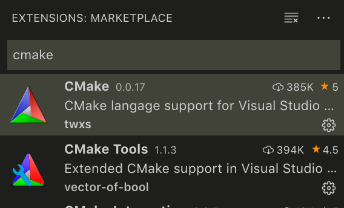
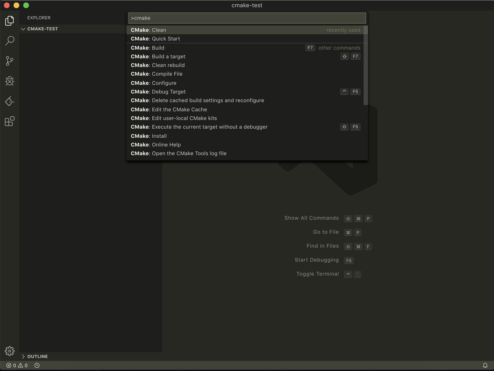
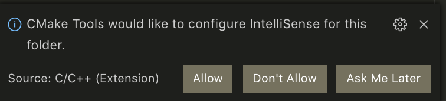

现在 vscode 的 C/C++ 插件已经十分完善，提供了良好的 IntelliSense 和调试，可以用于写一些小型项目了。但是，vscode 毕竟不是 IDE，默认并不提供任何自动化的项目构建。对于单个程序，可以使用 Code Runner 插件来直接编译；对于非常小的项目，可以考虑直接手写 Makefile；但对于稍微复杂的项目，自己编写 Makefile 是一件费心费力的工作，而且 Makefile 对新手并不友好。此时，CMake 是一个十分不错的选择：CMake 跨平台，配置简单，自动化程度高。因此，我尝试在 vscode 中使用 CMake 解决项目构建问题。

幸运的是，vscode 有两个插件已经解决了这个问题：CMake 和 CMake Tools。前者提供 CMakelists.txt 的语法高亮，后者提供 CMake 项目的构建和调试。安装了 C/C++ 插件后，在插件商店下载这两个插件：

新建一个空文件夹，用 vscode 打开。这个文件夹将作为我们的项目目录。按下 Ctrl+Shift+P（ macOS 为 Command+Shift+P ），键入 CMake 后可见一系列操作，点击 CMake: Quick Start。

然后会出现 Select a Kit 框，选择一套合适的编译器：

然后依次按指示操作，键入项目名，选择项目编译为库还是可执行程序。随后可能在右下角出现提示框：

选择 allow。这样一个初始的 CMake 项目就构建好了。你的目录下应该已经出现一个 build 目录，一个 CMakeLists.txt 和一个 main.cpp。

插件支持在项目中直接使用 Build、 Debug、和 CTest。功能在下方的指示条中：

注意不要在 CMake 项目中使用 vscode 内置的调试功能。CMake 会重新生成 launch.json，所以直接编辑项目的 launch.json 并不会起任何效果。

---

遇到的坑：在 macOS 已安装XCode的情况下，调试出现错误提示：
`lldb: unrecognized option '--interpreter=mi'`

经测试为新版本的 lldb 中已经将 `--interpreter` 选项移除，另设了 `lldb-mi` 命令，位于 `/Applications/XCode.app/Contents/Developer/usr/bin/lldb-mi`，由于不在 `$PATH` 中无法找到。解决办法为将这个目录添加到 `$PATH`，在 `~/.bash_profile` 中添加：`export PATH="/Applications/XCode.app/Contents/Developer/usr/bin:$PATH"` 即可。
